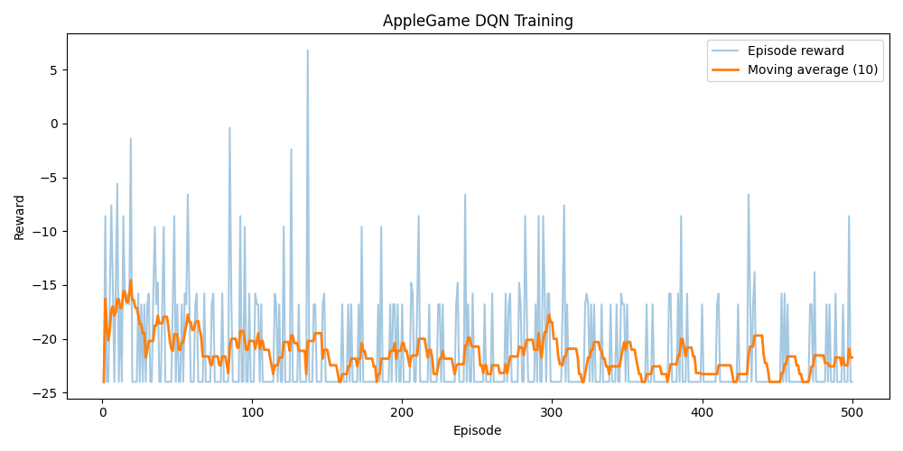

# 사과게임 강화학습 보고서

## 사용한 강화학습 기법
- Deep Q-Network (DQN)을 사용하여 사각형 행동 공간을 학습했습니다.

## 학습 수식
Double DQN을 사용하여 정책망으로 행동을 고르고 타깃망으로 가치를 평가합니다.

\[ y = r + \gamma Q_{\text{target}}\!\bigl(s', \arg\max_{a'} Q_{\text{policy}}(s', a')\bigr) \]

위 수식은 `reinforcement.py`의 `DQNAgent.train_step`에서 아래 코드로 구현되었습니다.

```python
with torch.no_grad():
    next_policy_actions = self.policy_net(next_states_tensor).argmax(1, keepdim=True)
    next_q_values = self.target_net(next_states_tensor).gather(1, next_policy_actions)
    targets = rewards_tensor + self.gamma * next_q_values * (1 - dones_tensor)
```

Prioritized Experience Replay를 도입하여 TD-error가 큰 전이 샘플일수록 자주 학습하고,
중복 샘플링 편향은 중요도 가중치로 보정했습니다.

## 학습 결과
- 총 Episode: 2000
- 평균 Reward: -30.04
- 최고 Reward: 0.60
- 학습 시간: 576.2 초



## 추가 메모
- 합이 10인 사각형만을 선택하도록 환경에서 보상 함수를 설계했습니다.
- 학습이 완료된 모델은 `models/apple_dqn.pt` 경로에 저장되며 실게임 수행 시 로드됩니다.